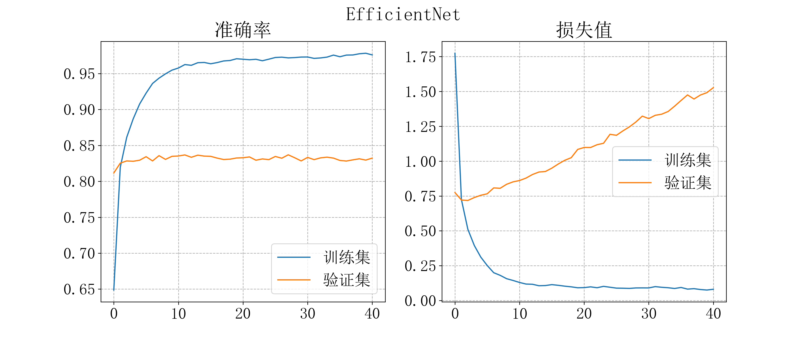

# CVPR_homeworks
保存大三上CVPR课程作业与笔记.

### Homework4

基于Caltech 256 数据集的深度网络分类性能比较，不少于三种深度网络结构，且全部模型精度不低于85%

#### Caltech256数据集分类

在[Caltech256数据集](https://www.kaggle.com/datasets/jessicali9530/caltech256)上进行数据分类，四种模型性能比较，后三种模型均为迁移学习，从TensorFlow Hub上下载的模型，具体请参考[本次作业报告](https://github.com/wty-yy/LaTex-Projects/blob/main/CVPR/hw4/CVPR4.pdf).

| 模型名称            | 模型大小 | 平均准确率 | 运行速度 |
| ------------------- | -------- | ---------- | -------- |
| VGG-19              | 485MB    | 85.814%    | 250s     |
| Inception-ResNet-v2 | 227MB    | 96.97%     | 100s     |
| MoblieNet           | 16.5MB   | 95.76%     | 23s      |
| EfficientNet        | 53.1MB   | 96.7%      | 41s      |

训练过程准确率和loss值请见[figure_logs](./code/hw4/figure_logs)文件夹，训练效果：

### Homework5 目标检测

提取Hog特征，并使用SVM进行分类，最后使用mAP进行评分.

特征提取及SVM模型训练：https://github.com/bikz05/object-detector/tree/master/object-detector，mAP评价目标检测器：https://github.com/Cartucho/mAP

上排图像从右到左为 Gauss 金字塔从大到小生成的结果，红框为滑动窗口过程中检测到的结果，左下角为全部过程中检测结果，右下角蓝框为 nms 处理重叠后的结果.

