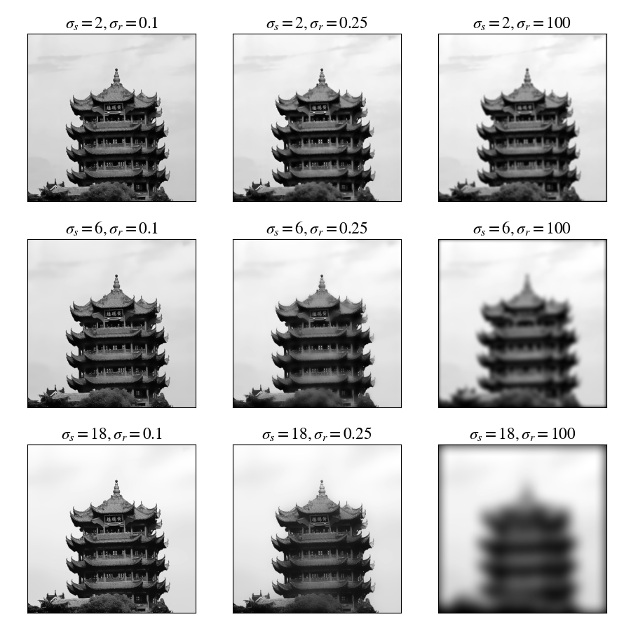

### 高斯滤波器

$$
G(x, y) = \frac{1}{2\pi\sigma^2}e^{-\frac{x^2+y^2}{2\sigma^2}}
$$
对高斯函数在 $(i,j)\ (-1\leqslant i,j\leqslant 1)$ 点处进行采样. 再进行归一化处理

#### 高斯核方差和滤波器大小关系

利用高斯函数的性质，在距离中心 $\sigma$ 中取到的体积占据总体积的 $68\%$，在 $2\sigma$ 中占比为 $95\%$，在 $3\sigma$ 中占比为 $99.7\%$，如下图所示：

这里取 $2\sigma$ 为高斯函数的边界，设滤波器大小为 $2k+1\times 2k+1$，则 $\sigma = \frac{k}{2}$. 以下为 $k=1$，大小为 $3\times 3$ 的高斯滤波器

#### 设计边界处理方法

#### 高斯核与高斯核的卷积

取最后两张图片的中心 $5\times 5$ 大小做差取绝对值，可以看出两者差值非常小，可近似相等，说明两个标准差为 $\sigma_1,\sigma_2$ 的卷积核，通过卷积可得到 $\sigma = \sqrt{\sigma_1^2+\sigma_2^2}$ 的卷积核：

#### 高斯核可分离实验

标准差为 $\sigma$ 的高斯核可分解为两个标准差为 $\sigma$ 一维高斯核的卷积.

#### 高斯核之差DOG

#### 图像锐化滤波器

$$
\begin{align*}
f_{sharp} =&\ f+\alpha(f-f_{blur})\\
=&\ (1+\alpha)I*f-\alpha G_{\sigma}*f\\
=&\ ((1+\alpha)I-\alpha G_\sigma)*f
\end{align*}
$$

所以 $(1+\alpha)I-\alpha G_\sigma$ 为锐化的核，$I$ 为全通滤波器（输入与输出图像相同），例如 $3\times 3$ 的如下
$$
I = \left[\begin{matrix}0&0&0\\0&1&0\\0&0&0\end{matrix}\right]
$$
在锐化滤波器操作中，由于做差后的图像正负值差距较大，如果直接使用线性正规化方法处理溢出部分，即：
$$
f(m,n)\leftarrow \frac{f(m,n)-\min(f)}{max(f)-min(f)}
$$
由于存在部分像素值较大，而低像素值的像素偏多，所以会导致整体色彩偏低. 为改进图像的亮度，使用与 $1$ 做最大值截断的方法进行正规化处理：
$$
f(m,n)\leftarrow \begin{cases}
1,& \quad f(m,n)-\min(f)>1,\\
f(m,n-\min(f)),& \quad\texttt{otherwise}.
\end{cases}
$$

执行相减后图像的亮度可能非常低，需要手动提高亮度，我将调节后的亮度均值维持在 $0.5$ 附近，这个调节亮度的操作就类似于锐化滤波器中的 $\alpha$，$\alpha$ 越大则最终图像的亮度越高.

可以看出 $\alpha=1,\sigma=6$ 时锐化效果较好.

#### 双边滤波

普通的高斯模糊只用到了图像**像素之间的距离关系**（空域），对每个像素使用相同的模糊处理，所以在图像的边缘部分处理效果不好. 而双边滤波器通过加入**像素值之间的关系**（值域），从而能较好的对边界部分进行处理.

记图像为 $I$，$\boldsymbol{p},\boldsymbol{q}$ 为像素点对应的向量，$I_{\boldsymbol{p}}$ 表示图像中 $\boldsymbol{p}$ 点对应的像素值，$S$ 为滤波器的向量空间，$G_\sigma$ 表示标准差为 $\sigma$ 的高斯函数，$||\cdot||$ 表示2-范数，$W_p$ 表示对滤波器进行归一化处理（保持前后图像亮度一致），则双边滤波器为
$$
\begin{aligned}
BF[I]_{\boldsymbol{p}} =&\ \frac{1}{W_\boldsymbol{p}}\sum_{q\in S}G_{\sigma_1}(||\boldsymbol{p}-\boldsymbol{q}||)G_{\sigma_2}(|I_{\boldsymbol{p}}-I_{\boldsymbol{q}}|)I_{\boldsymbol{q}}\\
W_\boldsymbol{p}=&\ \sum_{q\in S}G_{\sigma_1}(||\boldsymbol{p}-\boldsymbol{q}||)G_{\sigma_2}(|I_{\boldsymbol{p}}-I_{\boldsymbol{q}}|)\quad(\text{归一化常数})
\end{aligned}
$$
由上述公式可知，$G_{\sigma_1}(||\boldsymbol{p}-\boldsymbol{q}||)G_{\sigma_2}(|I_{\boldsymbol{p}}-I_{\boldsymbol{q}}|)$ 为点 $\boldsymbol{p}$ 处的双边滤波器核，而 $G_{\sigma_1}(||\boldsymbol{p}-\boldsymbol{q}||)$ 就是高斯核，$G_{\sigma_2}(|I_{\boldsymbol{p}}-I_{\boldsymbol{q}}|)$ 是值域之差作用高斯函数后的核，两个核做内积即得到在点 $\boldsymbol{p}$ 处的双边滤波器核，然后进行归一化处理.

### 傅里叶变换

一般的二维傅里叶变换公式为
$$
\hat{f}(u,v) = \iint_{\R^2}f(x, y)e^{-2\pi i(\frac{ux}{M}+\frac{vy}{N})}\,dxdy
$$
可以形象的理解为将图像 $f(x,y)$ 向**不同平面不同方向**的复平面波做内积，也即是求在 $e^{-2\pi i(ux+vy)}$ 上的投影.

#### 可视化

幅度谱和相位谱

注：幅度谱输出需要用线性变换将像素压缩到 $[0,1]$ 中.

我们将二维傅里叶变化后的空间称为 $K$ 空间，则 $K$ 空间中每一个像素表示一种二维正弦波，则 $K_{u,v}$ 处的夹角表示该种正弦波的相位大小，$|K_{u,v}|$ 表示该正弦波的幅度大小.

如果 $K$ 空间的相位全部等于0，那么相当于平面波在相加的时候，都没有移动，所以图像一定会呈现一种周期性，而且中间的点一点很亮. 这是因为复平面波没有移动，那么所有的平面波在中心点相位为0，$\exp(0)=1$，因此相当于所有的幅度叠加在一起了.

如果使得 $K$ 空间的幅度全部等于1，那么相当于平面波在相加的时候，只有移动，而没有了各个波的大小信息，低频成分和高频成分全都一样了，所以图像应该比较嘈杂，变化比较剧烈，但是能看见大体的轮廓. （由于相位图逆变换结果只有少数像素值，只能将像素值相对高一些的提高亮度，否则特征十分不明显）

#### 频域滤波

⾼斯滤波器进⾏图像的频率域滤波

我们分别取 $K$ 空间中低频部分（也就是靠中间的部分）和高频部分（也就是靠近边缘的部分）分别进行傅里叶逆变换.

下面两个图是对幅度谱进行Gauss核处理的结果，不是频域滤波的要求

使用大 $\sigma$ 和频域做点积的结果，和使用小 $\sigma$ 高斯核直接与图像做卷积得到的效果应该类似，突出细节（由理论推导最后一问可保证）

使用小 $\sigma$ 时注意输出频域图像时，不要再用 $log$ 进行调整了，因为像素已经相对非常集中了. 类似于使用大 $\sigma$ 直接对图像进行卷积得到的效果，即高斯模糊.

