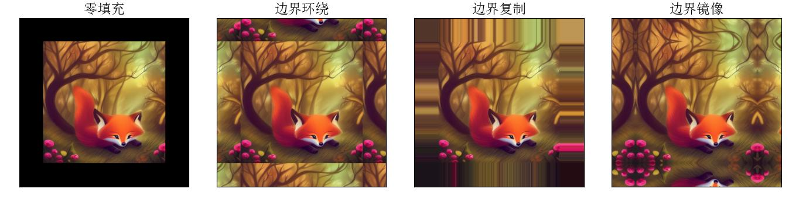
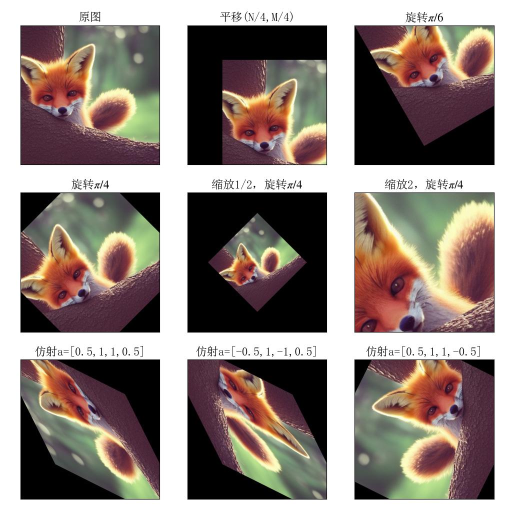

**⼀、图像变换（**图像⾃选，编程语⾔⾃选）

✓ 图像的参数化⼏何变换原理（参考书：计算机视觉-算法与应⽤，3.6章节）；

五种变换

✓ 图像的向前变换（forward warping）与图像的逆向变换（inverse warping）；

✓ 图像的下抽样原理与图像的内插⽅法原理（近邻插值与双线性插值）；

✓ 完成图像的⼏何变换实验，包括：平移变换；旋转变换；欧式变换；相似变换；仿射变换。

✓ 完成图像的⾼斯⾦字塔表示与拉普拉斯⾦字塔表示，讨论前置低通滤波与抽样频率的关系。

**⼆、特征检测（**图像⾃选，编程语⾔⾃选**）** 

✓ 基于⾼斯⼀阶微分的图像梯度（幅值图与⽅向图），分析⾼斯⽅差对图像梯度的影响；

✓ 掌握Canny边缘检测原理，完成图像的边缘检测实验，展示每个环节的处理结果（梯度图、NMS、边缘链接）；

✓ 掌握Harris⻆点检测原理，完成图像的⻆点检测实验，分析窗⼝参数对⻆点检测的影响，讨论⻆点检测的不变

性、等变性与定位精度等。

#### 完成上次未完成的填充操作

### 几何变换实验（5种变换）

图像坐标系默认是按照左上角为原点，纵轴向下为 $x$ 轴正方向，横轴向右为 $y$ 轴正方向，为便于输出查看，变化后的图像保持与原图像相同的大小，但这样就会发生图像大部分空白，所以需要使用平移矩阵将变化后的图像中心保持在输出框的中心，具体来说，假设图像大小为 $N\times M$，几何变换为 $T$，记图像中心点为 $\boldsymbol{x}_{mid} = (N/2,M/2)$ ，则考虑平移向量和对应的平移矩阵为
$$
\boldsymbol{t} = \boldsymbol{x}_{mid} - T\boldsymbol{x}_{mid},\quad T_{translation}=\left[\begin{matrix}1&0&t_1\\ 0&1&t_2\\0&0&1\end{matrix}\right]
$$
为了保证输出效果，处平移操作和旋转操作外，其他操作都进行平移.

### Gauss金字塔和Laplace金字塔

Gauss金字塔：使用Gauss核与图像做卷积，设定Gauss核移动步长为stride=2，于是每次可将整个图像缩小 $1/4$ 倍.

讨论低通滤波和抽样频率的关系

### Gauss一阶微分的图像梯度

幅度谱与相位谱，分析高斯方差对梯度的影响

### Canny边缘检测

梯度图、NMS、边缘连接

### Harris角点检测

