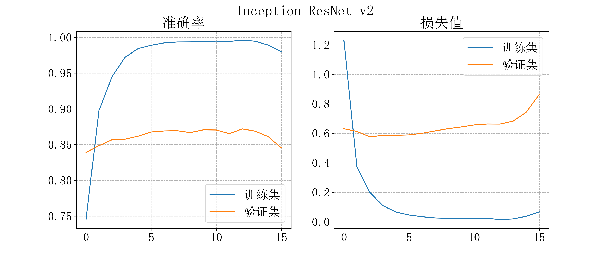
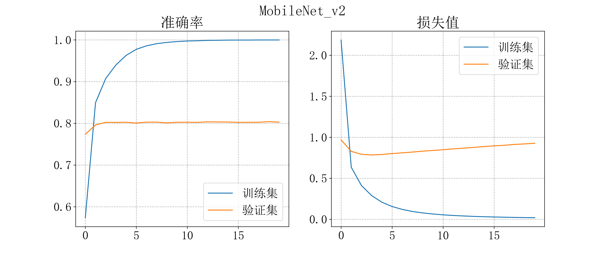
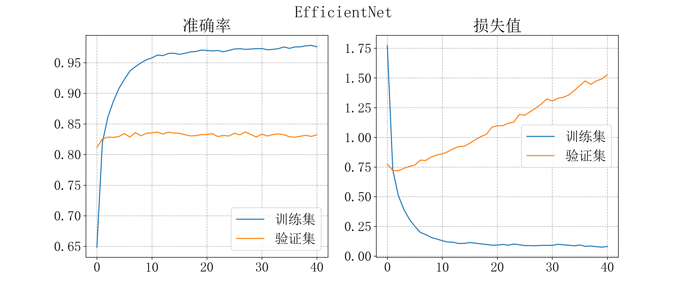

## Caltech256数据集分类

在[Caltech256数据集](https://www.kaggle.com/datasets/jessicali9530/caltech256)上进行数据分类，四种模型性能比较，后三种模型均为迁移学习，从TensorFlow Hub上下载的模型，具体请参考[本次作业报告](https://github.com/wty-yy/LaTex-Projects/blob/main/CVPR/hw4/CVPR4.pdf).

| 模型名称            | 模型大小 | 平均准确率 | 运行速度 |
| ------------------- | -------- | ---------- | -------- |
| VGG-19              | 485MB    | 85.814%    | 250s     |
| Inception-ResNet-v2 | 227MB    | 96.97%     | 100s     |
| MoblieNet           | 16.5MB   | 95.76%     | 23s      |
| EfficientNet        | 53.1MB   | 96.7%      | 41s      |

训练过程准确率和loss值请见[figure_logs](./figure_logs)文件夹，训练效果：

