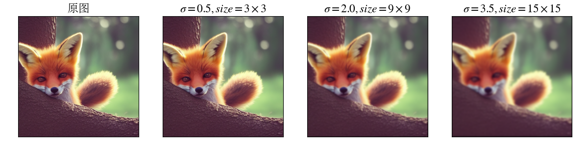
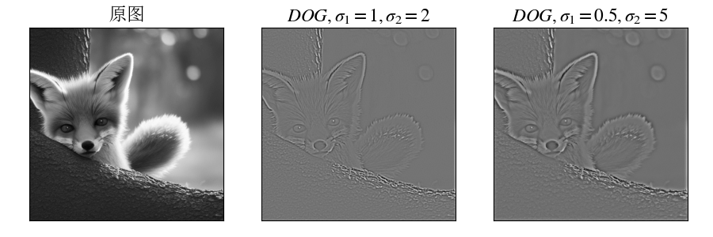
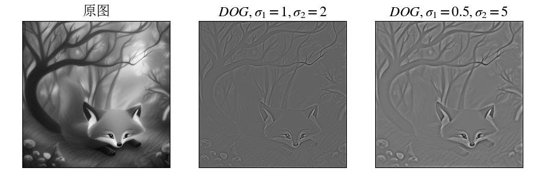
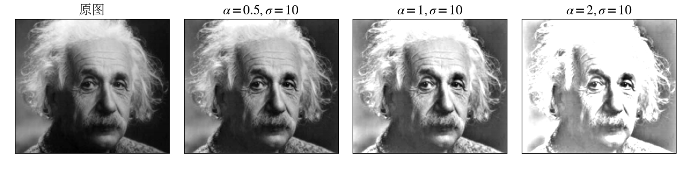

### 高斯滤波器

$$
G(x, y) = \frac{1}{2\pi\sigma^2}e^{-\frac{x^2+y^2}{2\sigma^2}}
$$
对高斯函数在 $(i,j)\ (-1\leqslant i,j\leqslant 1)$ 点处进行采样. 再进行归一化处理

#### 高斯核方差和滤波器大小关系

利用高斯函数的性质，在距离中心 $\sigma$ 中取到的体积占据总体积的 $68\%$，在 $2\sigma$ 中占比为 $95\%$，在 $3\sigma$ 中占比为 $99.7\%$，如下图所示：

这里取 $2\sigma$ 为高斯函数的边界，设滤波器大小为 $2k+1\times 2k+1$，则 $\sigma = \frac{k}{2}$. 以下为 $k=1$，大小为 $3\times 3$ 的高斯滤波器

#### 设计边界处理方法

#### 高斯核与高斯核的卷积

取最后两张图片的中心 $5\times 5$ 大小做差取绝对值，可以看出两者差值非常小，可近似相等，说明两个标准差为 $\sigma_1,\sigma_2$ 的卷积核，通过卷积可得到 $\sigma = \sqrt{\sigma_1^2+\sigma_2^2}$ 的卷积核：

#### 高斯核可分离实验

标准差为 $\sigma$ 的高斯核可分解为两个标准差为 $\sigma$ 一维高斯核的卷积.

#### 高斯核之差DOG

#### 图像锐化滤波器

$$
\begin{align*}
f_{sharp} =&\ f+\alpha(f-f_{blur})\\
=&\ (1+\alpha)I*f-\alpha G_{\sigma}*f\\
=&\ ((1+\alpha)I-\alpha G_\sigma)*f
\end{align*}
$$

所以 $(1+\alpha)I-\alpha G_\sigma$ 为锐化的核，$I$ 为全通滤波器（输入与输出图像相同），例如 $3\times 3$ 的如下
$$
I = \left[\begin{matrix}0&0&0\\0&1&0\\0&0&0\end{matrix}\right]
$$
在锐化滤波器操作中，由于做差后的图像正负值差距较大，如果直接使用线性正规化方法处理溢出部分，即：
$$
f(m,n)\leftarrow \frac{f(m,n)-\min(f)}{max(f)-min(f)}
$$
由于存在部分像素值较大，而低像素值的像素偏多，所以会导致整体色彩偏低. 为改进图像的亮度，使用与 $1$ 做最大值截断的方法进行正规化处理：
$$
f(m,n)\leftarrow \begin{cases}
1,& \quad f(m,n)-\min(f)>1,\\
f(m,n-\min(f)),& \quad\texttt{otherwise}.
\end{cases}
$$

执行相减后图像的亮度可能非常低，需要手动提高亮度，我将调节后的亮度均值维持在 $0.5$ 附近，这个调节亮度的操作就类似于锐化滤波器中的 $\alpha$，$\alpha$ 越大则最终图像的亮度越高.

可以看出 $\alpha=1,\sigma=6$ 时锐化效果较好.

#### 双边滤波

普通的高斯模糊只用到了图像**像素之间的距离关系**（空域），对每个像素使用相同的模糊处理，所以在图像的边缘部分处理效果不好. 而双边滤波器通过加入**像素值之间的关系**（值域），从而能较好的对边界部分进行处理.

记图像为 $I$，$\boldsymbol{p},\boldsymbol{q}$ 为像素点对应的向量，$I_{\boldsymbol{p}}$ 表示图像中 $\boldsymbol{p}$ 点对应的像素值，$S$ 为滤波器的向量空间，$G_\sigma$ 表示标准差为 $\sigma$ 的高斯函数，$||\cdot||$ 表示2-范数，则双边滤波器为
$$
BF[I]_{\boldsymbol{p}} = \frac{1}{W_\boldsymbol{p}}\sum_{q\in S}G_{\sigma_1}(||\boldsymbol{p}-\boldsymbol{q}||)G_{\sigma_2}(|I_{\boldsymbol{p}}-I_{\boldsymbol{q}}|)I_{\boldsymbol{q}}
$$
由上述公式可知，$G_{\sigma_1}(||\boldsymbol{p}-\boldsymbol{q}||)G_{\sigma_2}(|I_{\boldsymbol{p}}-I_{\boldsymbol{q}}|)$ 为点 $\boldsymbol{p}$ 处的双边滤波器核，而 $G_{\sigma_1}(||\boldsymbol{p}-\boldsymbol{q}||)$ 就是高斯核，$G_{\sigma_2}(|I_{\boldsymbol{p}}-I_{\boldsymbol{q}}|)$ 是值域之差作用高斯函数后的核，两个核做内积即得到在点 $\boldsymbol{p}$ 处的双边滤波器核.

### 傅里叶变换

在数分中，我们学过连续的傅里叶变换. 假设周期函数 $f(x)\in L^1(\R)$，周期为 $l$，则其对应的傅里叶积分为
$$
\hat{f}(x) = \int_{\R}f(y)e^{-\frac{2\pi i}{l}xy}\,dy
$$
如果我们稍作改动，傅里叶变换在整点处的取值就变成傅里叶级数的系数了
$$
\mathcal{F}(f)(x) = \frac{1}{l}\int_0^lf(y)e^{-\frac{2\pi i}{l}xy}\,dy
$$
$f$ 表示为傅里叶级数的形式
$$
f(x) = \sum_{|n|\in\Z}c_ne^{\frac{2\pi i}{l}nx} = \frac{a_0}{2}+\sum_{n=1}^\infty(a_n\cos\frac{2\pi nx}{l}+b_n\sin(\frac{2\pi nx}{l}))
$$
其中 $a_n = \frac{2}{l}\int_0^lf(x)\cos\frac{2\pi nx}{l}\,dx,\ n\geq 0$，$b_n = \frac{2}{l}\int_0^lf(x)\sin\frac{2\pi nx}{l}\,dx,\ m\geq 0$，
$$
c_n = \frac{1}{l}\int_0^lf(x)e(-\frac{n}{l}x)\, dx = \mathcal{F}(f)(x)
$$

其中 $e(t) = e^{2\pi it}$.

#### 离散傅里叶变换

$$
F(f)(x) = \frac{1}{N}\sum_{n=0}^{N-1}f(x)e()
$$

#### 可视化

幅度谱和相位谱

#### 频域滤波