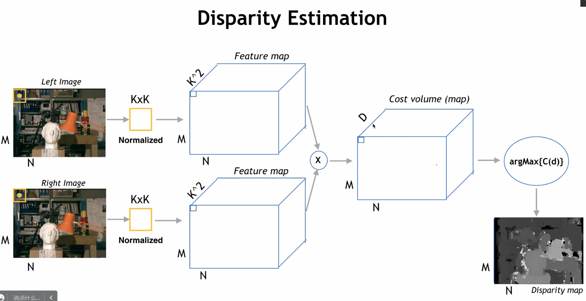

## 双目视立体

相机的性质：基线（baseline），视差（disparity），景深（depth），景深=基线/视差

### NCC图像相似性

通过相同相机拍摄的两张不同位置的图片，可以计算出物体的景深. 考虑 $M\times N$ 的图像，$K\times K$ 的移动窗口，截取 $K\times K$ 作为一个特征向量，正规化处理并拉伸成一维向量，每次移动 $d$ 个长度与另一幅图像做互相关，

### 相机旋转

对3D相机旋转，可以看做对图像的齐次坐标进行旋转.

### 误差来源

低对比度，遮挡问题，相机标定误差，较大的运动