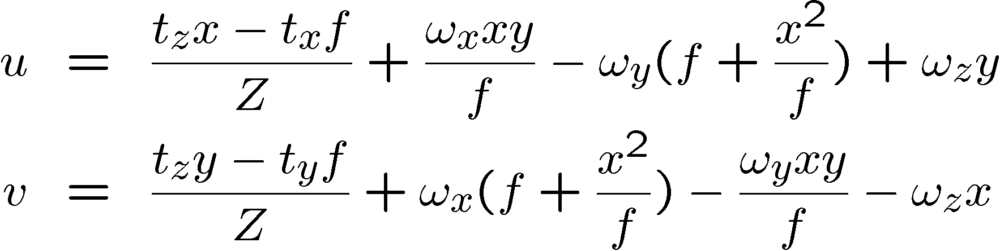

## CVPR Lecture 12

### 对极几何

对极线：从摄像机和视点的射线. 左对极线 $I$，右对极线 $I'$. 当两个相平面平行，则两个对极线平行.

极点：左摄像机极点 $e$，右摄像机极点 $e'$. 基线与相平面交点.

基线：两个相机的连线.

3D空间中的点 $X$ 移动，只有极线会发生变化.

对应点：3D点在两个不同平面上成像的两个点.

对极约束：将对应点搜索问题转化为对极线上搜索的问题.

#### 数学原理

针孔成像：$\lambda_1 x^{(1)}_{img} = K_1[R\quad t_1]x_w,\ \lambda_2 x^{(2)}_{img} = K_2[R\quad t_2]x_w$.

假设$K_1,K_2$为单位阵，以相机1作为坐标原点，$x_w'$ 可视为3D点的齐次坐标.

转化到规范化坐标系中：$\lambda_1 K_1^{-1}x_{img}^{(1)} = K[R\quad t_1]x_w$.

**规范化**：$\lambda_1x^{(1)}_{img} = [I\quad 0]x_w'=x_w,\ \lambda_2x^{(2)}_{img} = [R\quad t]x_w'=Rx_w+t$.

将左式代入右式再叉乘上 $x_{img}^{(2)}\cdot t$ 可得
$$
x_{img}^{(2)}\cdot t\times Rx_{img}^{(1)}=0
$$
由于叉乘可以写作矩阵乘法形式：$t\times R = [t]_{\times} R$.（$[t]_\times$ 为 $t$ 的**反对称矩阵**） 进一步写为
$$
x_{img}^{(2)T}[t]_{\times}Rx_{img}^{(1)}=0\Rightarrow x_{img}^{(2)T}Ex_{img}^{(1)}=0
$$
其中 $E = [t]_{\times}R$ 称为本质矩阵，有相机的旋转平移关系决定.

---

给定 $x_{img}^{(1)}$ 的像素点，则 $l=Ex_{img}^{(1)}$ 已知，于是 $x_{img}^{(2)T}l = 0 \Rightarrow l_xx_2+l_yy_2+l_z=0$，这说明 $x_{img}^{(2)T}$ 中的对应点在一条直线上，这条线就是上述的**对极线**. 从上述 $l$ 定义可以看出，$x_{img}^{(1)}$ 对应相机2的成像平面上的对极线.

令 $e_2=t_2$，则$e_2Ex_{img}^{(1)} = 0,\ \forall x_{img}^{(1)}$，也就是说所有所有的极线 $Ex_{img}^{(1)}$ 都过点 $e'$，这个点也即是右图像的**极点**.

如果直接在图像坐标系（原始坐标系）中讨论，则要作用逆矩阵 $x_{img}^{(1)} = K_1^{-1}x_w,\ x_{img}^{(2)} = K_2^{-1}x_w$，于是类似推导可得到
$$
x_{img}^{(2)T}K_2^{-T}[t]_{\times}RK_1^{-1}x_{img}^{(1)}=0\Rightarrow x_{img}^{(2)T}Fx_{img}^{(1)}=0
$$
其中 $F  =K_2^{-T}[t]_{\times}RK_1^{-1}$. （秩为 $2$，因为存在反对称矩阵 $[t]_{\times}$，存在极点 $e_1,e_2$，使得$Fe_1=F^Te_2=0$.

### 8点法估计F矩阵

若不清楚相机内参数 $K_1,K_2,R,t$ 则可通过对应点反解 $F$ 矩阵. 对应点满足的方程为 $x'^T F x = 0$，其中 $x'$ 与 $x$ 对应. 由于 $F$ 的自由度为 $8$，所以至少需要 $8$ 个对应点. 也可使用最小二乘法或SVD分解.

求解出来的 $F$ 的秩可能不为 $2$，通过SVD分解令第三个特征值为 $0$，再恢复 $F$ 矩阵.

## 相机成像总结

单视点

双视点，双目立体视觉（难点：平面对应）

对极约束：在一条直线上搜索对应点.

从运动恢复结构

## 运动场

运动场：3D点在成像平面随时间发生的变换称为二维运动场. （3D平移或旋转运动）

使用针孔相机模型：$P = [X\quad Y\quad Z],\  p = [x\quad y\quad f]$，$P$ 为3D中的点，$p$ 为投影平面上的齐次坐标. 则 $p = fP/Z$.

3D运动可描述为 $V = -t-w\times P$，考虑相点 $p$ 的运动速度

第一项为平移分量，与深度 $Z$ 相关；后续三项为旋转分量，与深度 $Z$ 无关. 将上式统一写为矩阵的形式：

在 $Z$ 轴方向平移，存在膨胀中心 FOE(focus of expansion)，所有平移的交点，类似于平行线必有交点.

在 $X,Y$ 轴方向平移，运动方向平行，运动大小与深度成反比.

旋转与深度无关，同样存在旋转中心.

## 光流估计

光流：图像中亮度模式的表观（明显的）运动.

光流是一个速度场，可将图像变换到下一个图像上.

#### 假设条件：

1. 两个相邻的亮度不会发生变化（亮度恒常性）

2. 微小运动：运动距离不大.

3. 空间相关性：相邻点具有相同的运动方向.

亮度恒常性方程：
$$
I_x\cdot u+I_y\cdot v+I_t=0
$$
通过该方程可以求出法向流，光流移动的法向方向.

孔径问题：条件不够无法求解具体运动方向.

在其邻域应该具有相同的运动向量.

空间相干约束：假设像素的邻域具有相同的运动方向. 所以可以获得更多的方程. 例如选取一个 $5\times 5$ 的窗口中有 $25$ 个亮度恒常性方程：

利用最小二乘法求解，考虑类似角点检测的思路，判断 $A^TA$ 的特征值大小.

用**Lucas-Kanade 流场算法**求解.

可通过Gauss金字塔将大运动转化为小运动，再进行L-K算法. 在将运动做逆变换，得到原尺度上的大运动.

