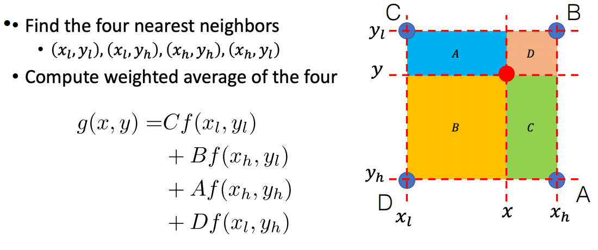

信号混淆：

高频信号可能与低频信号产生混淆

- 直接消去高频信号（滤波，消去高频波）
- 在高频部分进行更多的采样

Nyquist采样定理：采样频率至少需要高于最高频率的两倍.

#### 高斯金字塔：先滤波再进行下采样.

可通过Gauss滤波器从而去掉高频信号.

下采样：各行和列进行采样

#### 上采样

1. 先用0进行填充
2. 使用Gauss模糊进行填充.
3. 数值矫正. 由于加入了0进行填充，所以亮度较低，需要整体调高数值.

#### Laplacian金字塔

通过先下抽样再上抽样，再相减，得到细节图像. 从而可以通过低分辨率的图像和对应的细节可以重新生成高分辨率的图像.

#### 插值算法

- Gauss插值
- $g(x, y) = \sum_{x'}\sum_{y'}w(x,x',y,y')f(x',y')$
- 拷贝最近的像素（有锯齿）
- 双线性插值（找到四个最近的像素，然后进行线性运算，使用插值点到目标点最远的面积作为系数，A表示蓝色区域的面积，$f(x,y)$ 表示点 $(x,y)$ 处的像素）

#### 几何变换

二维矩阵：缩放，旋转，剪切，对称

三维矩阵（多加一维）：仿射（保持平行），平移