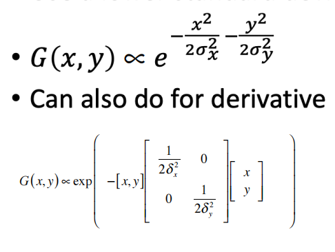

# Computer Version Lecture 6

边界出现的位置：

1. 亮度改变
2. 拐角，交叉点
3. 深度不连续（前景和背景前后深度不同）
4. 曲面法向量不连续（曲面不连续）
5. 反射表面不同（物体表面不同的涂色）
6. 阴影边

### 图像微分

对图像 $F$ 进行微分，$\frac{\partial f}{\partial x}[x, y]\approx F[x+1,y]-F[x,y]$，可用微分卷积核代替

### Gauss微分核

利用偏导对卷积的可交换性，可先对Gauss函数进行求微分，再作用在图像上.

### Gauss各向异性的

### Canny边缘检测器

1. 分别作用x，y方向的Gauss微分核
2. 找到$||\nabla f||$和$\theta$（$\nabla f$的方向）
3. 非最大化压缩，将非最大值的像素去掉.
4. 阈值处理，通过高阈值得到边缘曲线，低阈值进行连接曲线.

### 评判检测器的好坏

检测正确（能正确区分边缘），定位正确（结果尽可能接近原图的边缘），单响应（每条边保持一个像素）