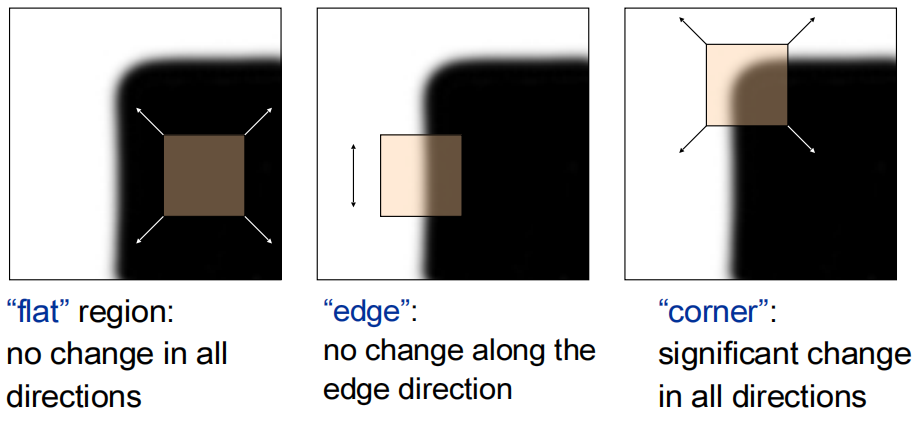
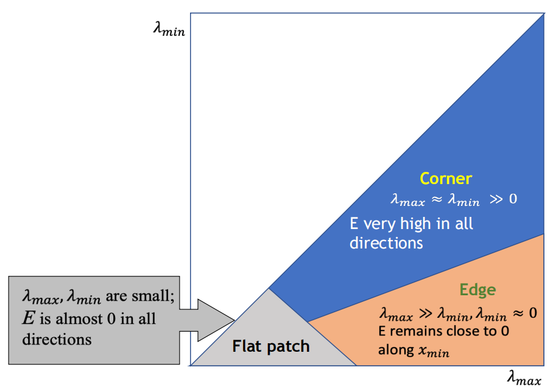
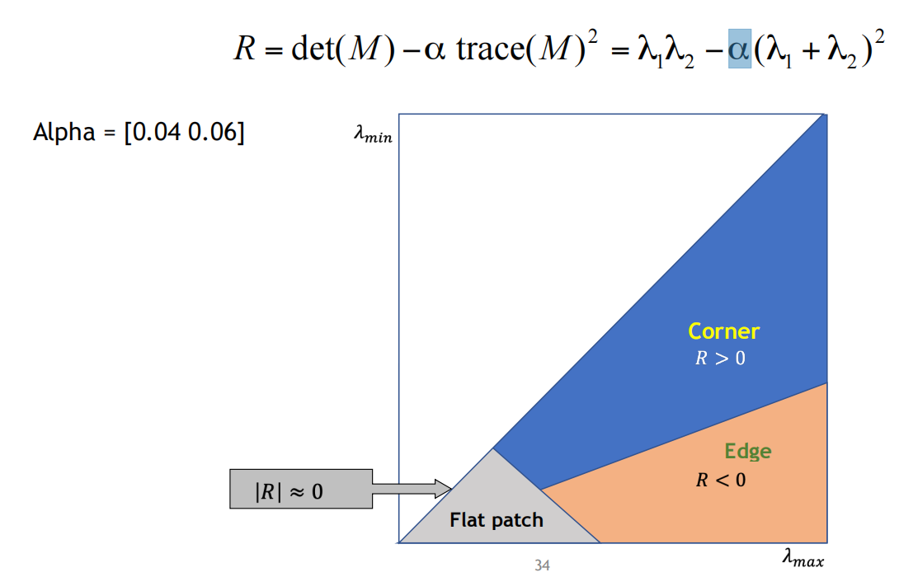
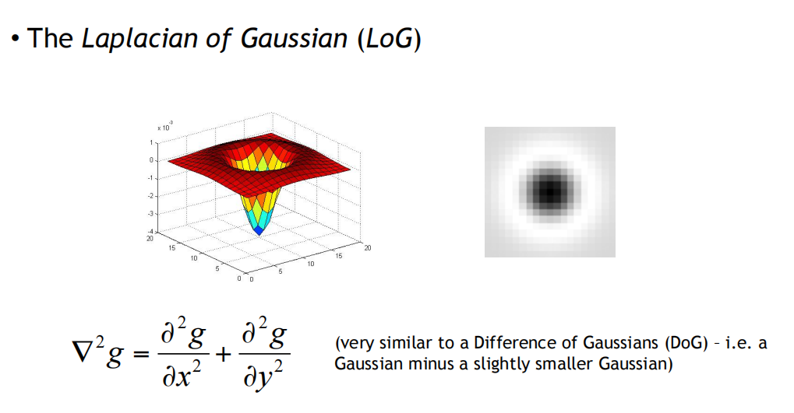
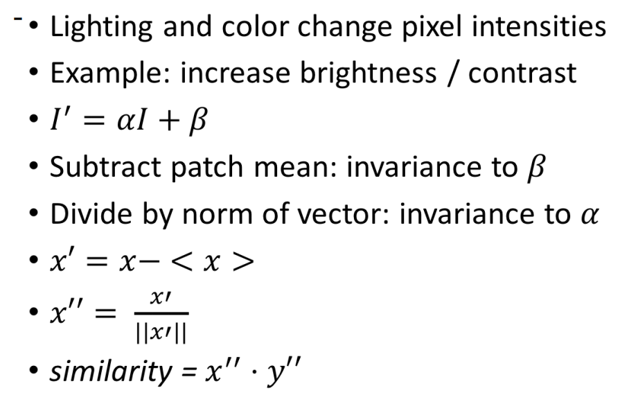
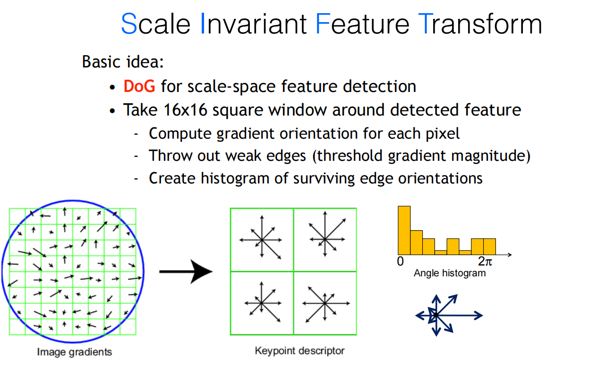

## Computer Vision Lecture 7，8

### 边角探测

主要思想：通过平移小窗口（patch），如果在**任意方向上**均产生**较大像素变化**时，则是边角.

令 $W$ 为平移窗口，平移方向为 $(u,v)$，将窗口中的像素列为行向量形式：
$$
\phi_0 = [I(0,0),I(0,1),\cdots,I(n,n)]\\
\phi_1 = [I(0+u,0+v),I(0+u,1+v),\cdots,I(n+u,n+v)]
$$
用两个图像间的二范数距离平方（Sum up squared different, SSD）定义图像的差距（Error）
$$
E(u, v) = ||\phi_0-\phi_1||_2^2=\sum_{(x,y)\in W}(I(x,y)-I(x+u,y+v))^2
$$
通过Taylor展开可得
$$
I(x+u,y+v)=I(x,y)+\frac{\partial I}{\partial x}u+\frac{\partial I}{\partial y}v+O(u^2+v^2)
$$
于是
$$
E(u,v) = \sum_{(x,y)\in W} (I_xu+I_yv)^2 = au^2+2buv+cv^2
$$
其中
$$
a = \sum_{(x,y)\in W}I_x^2,\quad b=\sum_{(x,y)\in W}I_xI_y,\quad c=\sum_{(x,y)\in W}I_y^2
$$
$a$ 是图像在 $x$ 方向上偏导的二阶矩.

加上权重函数 $w(x, y)$ 得到一般形式：
$$
E(u,v) = \sum_{(x,y)\in W} w(x,y)(I_xu+I_yv)^2
$$
若记
$$
A = \sum_{x,y}I_x^2,\quad B = \sum_{x,y}I_xI_y,\quad C = \sum_{x,y}I_y^2
$$
写成二次型形式（Second moment matrix）
$$
E_{x,y}(u,v)\approx [u\quad v]\left[\begin{matrix}
A_{x,y}&B_{x,y}\\B_{x,y}&C_{x,y}
\end{matrix}\right]\left[\begin{matrix}u\\v\end{matrix}\right] =[u\quad v]M\left[\begin{matrix}u\\v\end{matrix}\right]
$$
所以可以讨论矩阵以下矩阵的正定性，
$$
\left[\begin{matrix}
A_{x,y}&B_{x,y}\\B_{x,y}&C_{x,y}
\end{matrix}\right]
$$

- 选定一个窗口大小 $k\times k$.
- 计算 $I_x,I_y$.
- 计算 $I_x^2,I_y^2,I_xI_y$ 与高斯卷积核 $w(x,y) = \exp(-\frac{(x-x_0)^2+(y-y_0)^2}{\sigma^2})$ 的积分
- 讨论每个点处矩阵的特征值.
- 设计角点响应函数（Corner response function）（打分函数）
- 非最大化决策，通过打分值判断是否是角点.

Harris响应函数

### 不变性与等变性

不变性**invariant**：$f(g(x)) = f(x)$

等变性**equivariant**：$f(g(x)) = g(f(x))$ 或 $f(g(x)) = t(f(x))$.

平移后的图像是否能检测到相同位置处的角点.

- 光强度变化，$I'\leftarrow aI+b$，之和 $a$ 相关，与 $b$ 无关.

- 平移等变性 $f(g(x)) = g(f(x))$.
- 旋转等变性，只有特征向量随之旋转，但特征向量值不变，响应函数大小也不变化.

响应函数对平移旋转具有不变性.（数值不变）

角点位置对平移旋转具有等变性.（相对位置不变）

但对于缩放图像不具有不变性，引入自适应尺度选择器

### 自适应尺度选择器(Automatic Scale Selection)

通过在一个位置逐渐增大扫描窗口大小，选取包含角点最多的一个窗口大小.

实现方法：固定窗口位置和大小，通过Gauss金字塔修改图片的尺度大小，得到不同的.

##### Blob算法

通过作用Laplacian of Gaussian（LoG）

通过不断修改Gauss函数的 $\sigma$ 大小，取得分最高的结果，可得到最优窗口的大小.

### 特征匹配

不变性：两个相关的特征区域的差别较小.

可分辨性：一个点应该和其他点有明显的区别.

选定一个窗口patch在图像上进行查找.

方法1（SSD）：直接做差.

### NCC Normalized Cross Correlation（归一化交叉相关性）

一种对图像正规化方法：

### SIFT（梯度特征提取）

旋转变化的主方向，对每个方向计算梯度，然后设定基础方向，将图像原有每个梯度投影到最近的基础方向上，并且进行分块求和，从而减少空间敏感性.

