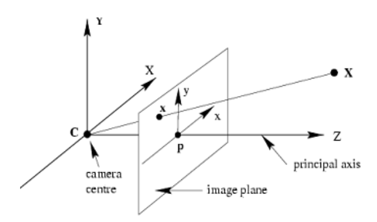
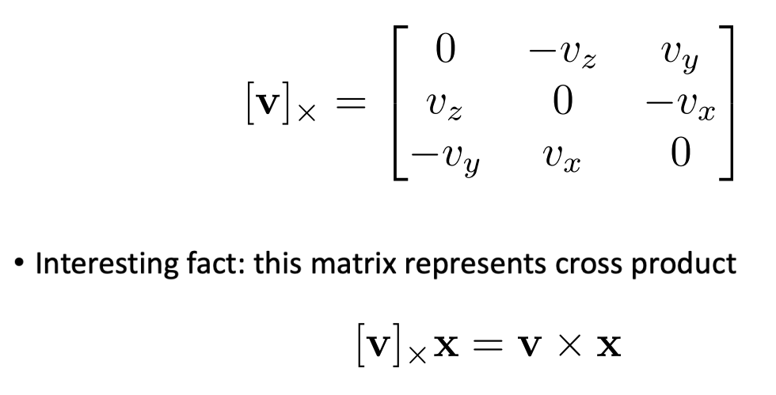
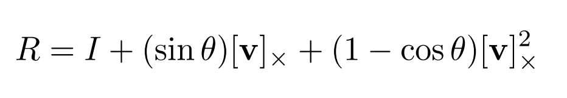
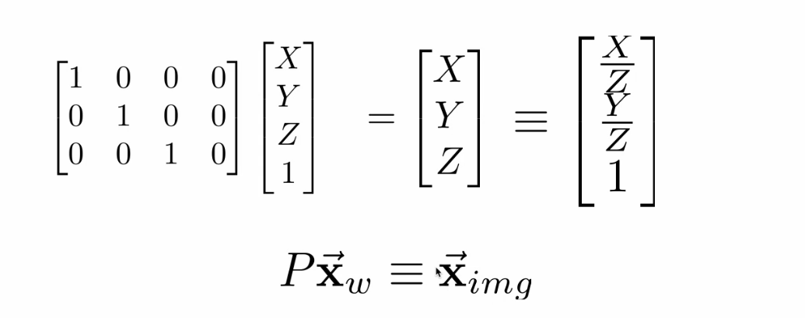
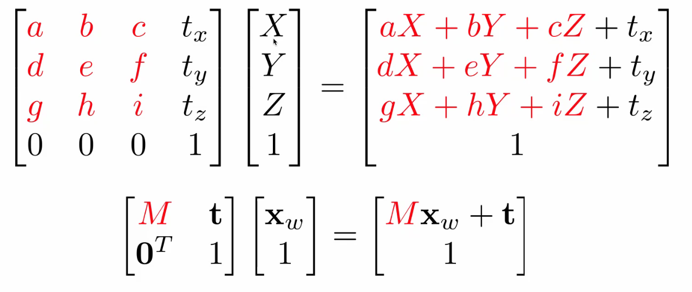
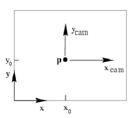
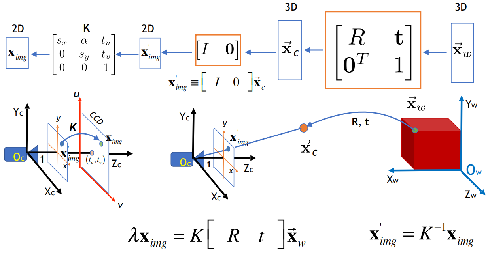
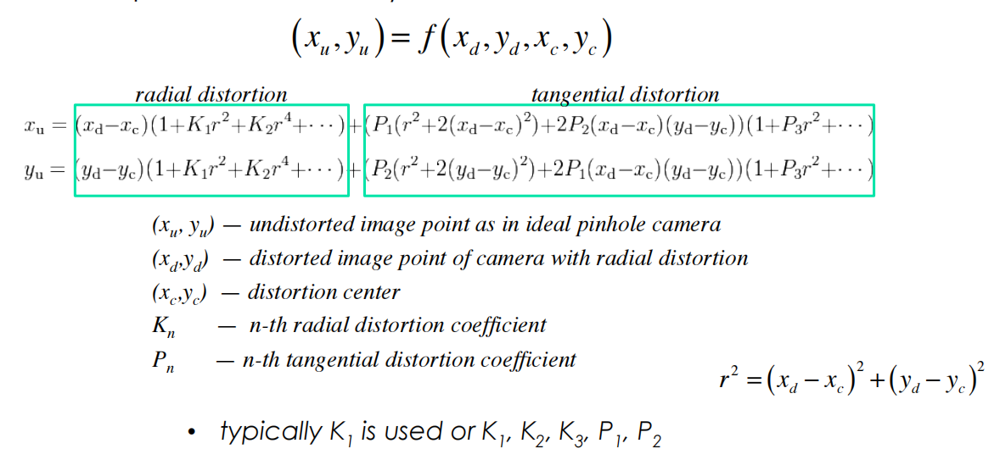

## Computer Vision Lecture 9,10

### RANSAC带鲁棒性的线性拟合

### 针孔相机模型成像的性质

从3D空间投影到2D平面，空间中 $(X,Y,Z)$，在相机上成像为（投影方程, projection equation） $(-X/Z,-Y/Z,-1)$，旋转后为 $(X/Z, Y/Z, 1)$.

1. 近大远小.
2. 无穷远平行线均收敛于一点.
3. 无穷远平面具有消失线.

相机作用：将图像转化为像素，将光强度转化为像素值.

### 坐标系统

以相机为中心，z轴为摄像机镜头方向

旋转矩阵 $R$，旋转主轴为 $v$，则 $Rv=v$，旋转矩阵为

### 齐次坐标 homogenous coordinate

$(x ,y, z)\sim \lambda(x, y, z)$. $(x,y , z)$ 齐次坐标为 $(x/z,y/z,1)$，齐次坐标就是等价类
$$
[(x,y)] = [(x,y,1)] = \{(zx,zy,z)\in\R^3:z\neq 0\}
$$

投影可转化为对3D空间的齐次坐标乘上透视**投影矩阵**，得到二维齐次坐标

平移也可是在齐次坐标的矩阵乘法

$M$ 为仿射矩阵，$t$ 为平移向量.

转化为二维齐次坐标后在将相机坐标系平移到相机屏幕的左下角即可.（矩阵 $K$）

综上，使用 $x_{img} \equiv K[R\quad t]x_{world}=Px_{world}$ 这里左边不写等号因为差一个尺度因子 $\lambda$，即 $\lambda x = Px$，可将3D空间物体进行2D方向投影.

$[R\quad t]$：外参数，由外界世界所确定，如进行移动相机位置.

$K$：称为规范化矩阵，转化相机内像素位置（变焦，内参数）.

### Brown畸变模型

通过标定图片和畸变图片确定畸变参数从得到未畸变图像.

### 相机标定

若得知相机的相关信息，即可将三维空间中加入新事物，再拍摄得到新的图像. $x_{img}=Px_{world}$，$P$ 为 $3\times 4$ 矩阵共有 $11$ 个自由度.
